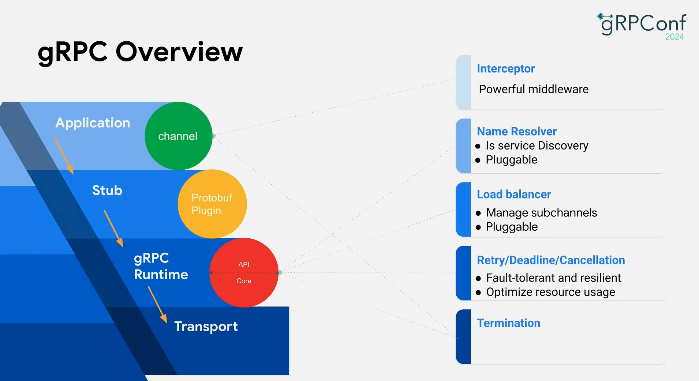

Remote Procedure Call (RPC) over HTTP/2 with Protocol Buffers.

## What is gRPC

An open-source, high-performance RPC framework. A client calls a method on a server on a
different machine **as if it were a local object** — gRPC handles the networking. Runs on
**HTTP/2**, uses **Protocol Buffers** as its Interface Definition Language (IDL) and wire
format by default.

- Home / docs: https://grpc.io/docs/what-is-grpc/introduction/
- Origin: Google's internal **Stubby**, generalized and open-sourced as gRPC (2015). The "g" is [a rotating backronym](https://github.com/grpc/grpc/blob/master/doc/g_stands_for.md).

The whole architecture at a glance — the layered stack (Application → Stub → gRPC Runtime
→ Transport) plus the pluggable pieces this note drills into below (interceptors, name
resolution / service discovery, load balancing, retry / deadline / cancellation):



*Source: Ivy Zhuang's talk — gRPC overview (gRPCConf 2024).*

## Start here: the Service Definition

Everything flows from the contract. gRPC is built *around the idea of defining a service*
— specifying the methods that can be called remotely with their parameters and return
types.

1. Write a `.proto` file — the contract (`message` = data shapes, `service` = the RPCs).
2. Run `protoc` (with the gRPC plugin) → generates **client stubs** and **server interfaces** in your language.
3. Server implements the interface; client calls the stub.
4. Because both sides are generated from the same `.proto`, they **can't drift out of sync**.

[Core concepts — Service definition](https://grpc.io/docs/what-is-grpc/core-concepts/#service-definition)

```proto
service HelloService {
  rpc SayHello (HelloRequest) returns (HelloResponse);
}

message HelloRequest  { string greeting = 1; }

message HelloResponse { string reply = 1; }
```


My hands-on version of this whole loop (Python + SQLite) lives in the repo at
`projects/slack-clone/message-service`.


## Protobuf's dual role

Protocol Buffers is **both**:

- the **IDL** (Interface Definition Language) — the language you define messages and services in, and
- the **serialization mechanism** — a compact, strongly-typed binary format on the wire (smaller/faster than JSON text).

Use **proto3** with gRPC. → https://protobuf.dev

### Why the binary encoding is small

JSON ships the field *names* as text on every message. Protobuf ships a **tag number**
instead, plus [varint](https://protobuf.dev/programming-guides/encoding/#varints) length
encoding.

```text
{"id":"123","name":"john doe"}          // JSON, ~30 bytes, names on the wire
0A 03 31 32 33 12 08 6A 6F 68 6E ...     // protobuf, ~15 bytes: <tag><len><bytes>
```

Each field on the wire is `(field_number << 3) | wire_type`. That's *why* field numbers
are the permanent identity of a field and renaming is free but renumbering is a breaking
change.

- [Encoding spec](https://protobuf.dev/programming-guides/encoding/) — the actual byte layout
- [Proto3 language guide](https://protobuf.dev/programming-guides/proto3/)
- [Schema evolution rules](https://protobuf.dev/programming-guides/proto3/#updating) — add fields with new tags = backward compatible; never reuse a retired tag; use `reserved`

## Four kinds of service methods

| Type | Shape | Proto signature |
|---|---|---|
| **Unary** | 1 req → 1 resp | `rpc SayHello(HelloRequest) returns (HelloResponse);` |
| **Server streaming** | 1 req → stream of resp | `rpc LotsOfReplies(HelloRequest) returns (stream HelloResponse);` |
| **Client streaming** | stream of req → 1 resp | `rpc LotsOfGreetings(stream HelloRequest) returns (HelloResponse);` |
| **Bidirectional streaming** | stream ↔ stream (independent read/write) | `rpc BidiHello(stream HelloRequest) returns (stream HelloResponse);` |

The `stream` keyword on the request/response side is what distinguishes them. Bidi streams
are **independent** — order is preserved within each direction, but the two directions
aren't lock-stepped.

[Core concepts — the four service methods](https://grpc.io/docs/what-is-grpc/core-concepts/#rpc-life-cycle)

## RPC lifecycle

[Core concepts — RPC life cycle](https://grpc.io/docs/what-is-grpc/core-concepts/#rpc-life-cycle). Key topics:

- **Deadlines / timeouts** — client sets how long it'll wait; server can check if it's still worth continuing. This is a *deadline* (absolute point in time), propagated across hops — better than a per-hop timeout. [Deadlines blog](https://grpc.io/blog/deadlines/)
- **Cancellation** — either side can cancel; ends the RPC, no more work done.
- **RPC termination** — client and server decide **independently** that the call is complete.
- **Metadata** — key/value info about the call, separate from the payload (auth tokens, tracing). [guide](https://grpc.io/docs/guides/metadata/)
- **Channels** — a client's virtual connection to a server (host/port) with configurable state (backed by ≥1 HTTP/2 connection).

### Error model

gRPC has its **own status codes**, not HTTP status codes: `OK`, `INVALID_ARGUMENT`,
`NOT_FOUND`, `DEADLINE_EXCEEDED`, `UNAVAILABLE`, `RESOURCE_EXHAUSTED`, etc. `UNAVAILABLE`
is the retryable one.

- [Status codes](https://grpc.io/docs/guides/status-codes/) · [richer error details (`google.rpc.Status`)](https://grpc.io/docs/guides/error/)

### Interceptors (the middleware story)

Client- and server-side hooks for auth, logging, metrics, retries — the gRPC equivalent of
HTTP middleware. [Interceptors guide](https://grpc.io/docs/guides/interceptors/)

### Retries & hedging

gRPC can retry failed calls and **hedge** (race duplicate calls to cut tail latency)
declaratively via service config — no app code. Hedging is a general distributed-systems
technique, not a gRPC feature; see [Request Hedging](../../reliability/request-hedging/)
for the concept and tradeoffs. [gRPC retry/hedging guide](https://grpc.io/docs/guides/retry/)

## Why HTTP/2 matters

gRPC rides on HTTP/2, which gives it:

- **Multiplexing** — many concurrent calls (streams) over **one** TCP connection; no app-layer head-of-line blocking *between* calls.
- **Native bidirectional streaming** — not just request/response.
- **Binary framing** — efficient, compact (pairs well with binary protobuf).
- **Header compression** (HPACK — Header Compression for HTTP/2) — less per-call overhead.
- **Persistent connections** — avoids repeated handshakes.

[HTTP/2 — RFC 9113](https://www.rfc-editor.org/rfc/rfc9113.html) · deeper: [*High Performance Browser Networking*, HTTP/2 chapter](https://hpbn.co/http2/) (Ilya Grigorik, free online)


HTTP/2 multiplexing still runs over a single **TCP** stream, so a lost packet stalls
*all* multiplexed streams (TCP-level head-of-line blocking). HTTP/3 / QUIC fixes this by
moving to UDP with per-stream loss recovery.


## Where to use it

- **Internal, service-to-service** comms in microservices — strong typing catches errors at compile time; binary is far more efficient than JSON/HTTP (benchmarks cite up to ~10× throughput). Best when latency is network-dominated.
- **Not** for public-facing APIs / clients you don't control — tooling is less ubiquitous than JSON-over-HTTP, and **browsers can't speak raw gRPC**.
- Common pattern: **gRPC internal, REST external**.

### Browser gap → gRPC-Web

Browsers can't do raw gRPC (no access to HTTP/2 frames / trailers). **gRPC-Web** is a
JS client + a proxy (Envoy or the standalone proxy) that translates.

- [gRPC-Web](https://github.com/grpc/grpc-web) · [Envoy gRPC-Web filter](https://www.envoyproxy.io/docs/envoy/latest/configuration/http/http_filters/grpc_web_filter)

## Load balancing gRPC (the sharp edge at scale)

A naive Layer 4 (L4, the transport layer — TCP/UDP) load balancer (LB) **breaks** gRPC
balancing: because gRPC keeps **one long-lived HTTP/2 connection** and multiplexes all
calls over it, connection-level (L4) balancing pins a client to one backend and every
request rides that same pin. You need **request-level** balancing at Layer 7 (L7, the
application layer — HTTP), or **client-side** balancing.

- gRPC has **built-in client-side load balancing** (pick_first, round_robin) + **xDS** (the discovery protocol family behind Envoy — Listener/Route/Cluster/Endpoint Discovery Service, `*DS`) for dynamic discovery/config from a control plane (the same API Envoy uses).
- [gRPC load balancing blog](https://grpc.io/blog/grpc-load-balancing/) · [Custom LB policies](https://grpc.io/docs/guides/custom-load-balancing/) · [gRPC + xDS](https://grpc.io/docs/guides/xds/)

## Talks & deeper resources

_(cited by title/speaker/venue; verify the exact URL before relying on it)_

- **Ivy Zhuang** — *gRPC overview* — [YouTube](https://www.youtube.com/watch?v=sImWl7JyK_Q). SWE at Google & gRPC Java maintainer.
- Official [gRPC guides index](https://grpc.io/docs/guides/) — auth, retries, keepalive, health checking, reflection, deadlines.

## Quick self-check (recall from memory)

1. Why can't a browser call a gRPC service directly, and what's the fix?
2. Why does a plain L4 load balancer distribute gRPC *connections* fine but *requests* badly?
3. What's safe vs breaking when editing a `.proto`? (rename field? renumber? delete?)
4. Deadline vs timeout — why does gRPC prefer deadlines across a call chain?
5. When would you pick server-streaming over just returning a `repeated` field?
